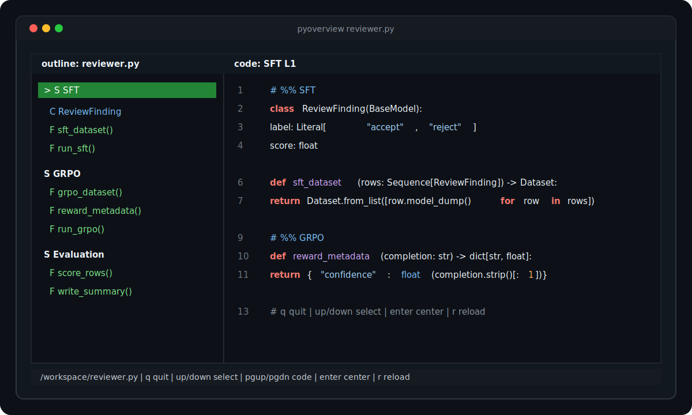

# pyoverview

`pyoverview` is a small terminal outline browser for Python and Markdown files.
For Python, it parses a module with Python's `ast` module. For Markdown, it
parses `#`, `##`, and `###` headings.

- left pane: classes, functions, async functions, nested definitions, sections,
  or Markdown headings
- right pane: source text on the terminal's default background, automatically
  scrolled to the selected symbol



## Python Sections

Add module-level section comments to group the outline into larger chunks:

```python
# region Configuration

DEFAULT_MODEL = "gpt-5"


def load_config():
    ...


# region Review Model

class Finding:
    ...


async def score_patch():
    ...
```

`# %% Title` cell comments are also supported:

```python
# %% SFT

def sft_dataset():
    ...


# %% GRPO

def grpo_dataset():
    ...
```

Markdown-style comment headings are supported too. `#`, `##`, and `###` create
nested sections:

```python
# Training

def load_rows():
    ...


## SFT

def sft_dataset():
    ...


### Formatting

def format_prompt():
    ...
```

`pyoverview` renders those comments and headings as section nodes:

```text
reviewer.py
  section: Training  L1
    function: load_rows()  L3
    section: SFT  L7
      function: sft_dataset()  L9
      section: Formatting  L13
        function: format_prompt()  L15
```

Only comments starting at the beginning of a line with `# region `, `# %% `,
`#%% `, `# `, `## `, or `### ` create Python sections. A section runs until the
next section marker at the same or higher heading level, or the end of the file.

## Markdown Headings

Markdown files use real headings as outline sections:

```markdown
# Training

## SFT

### Formatting

# Evaluation
```

Headings inside fenced code blocks are ignored. Only `#`, `##`, and `###`
headings are included.

## Install

```sh
uvx pyoverview path/to/module.py
uvx pyoverview path/to/notes.md
```

If you are developing locally:

```sh
uv run pyoverview path/to/module.py
```

## Keys

- `Up` / `Down`, `k` / `j`: move through the outline
- `PageUp` / `PageDown`: scroll code
- `g` / `G`: jump to first / last outline item
- `Enter`: center the selected symbol in the code pane
- `r`: reload the file from disk
- `q`: quit

## Non-interactive Use

```sh
pyoverview --print path/to/module.py
```

This prints the outline without opening the TUI.
